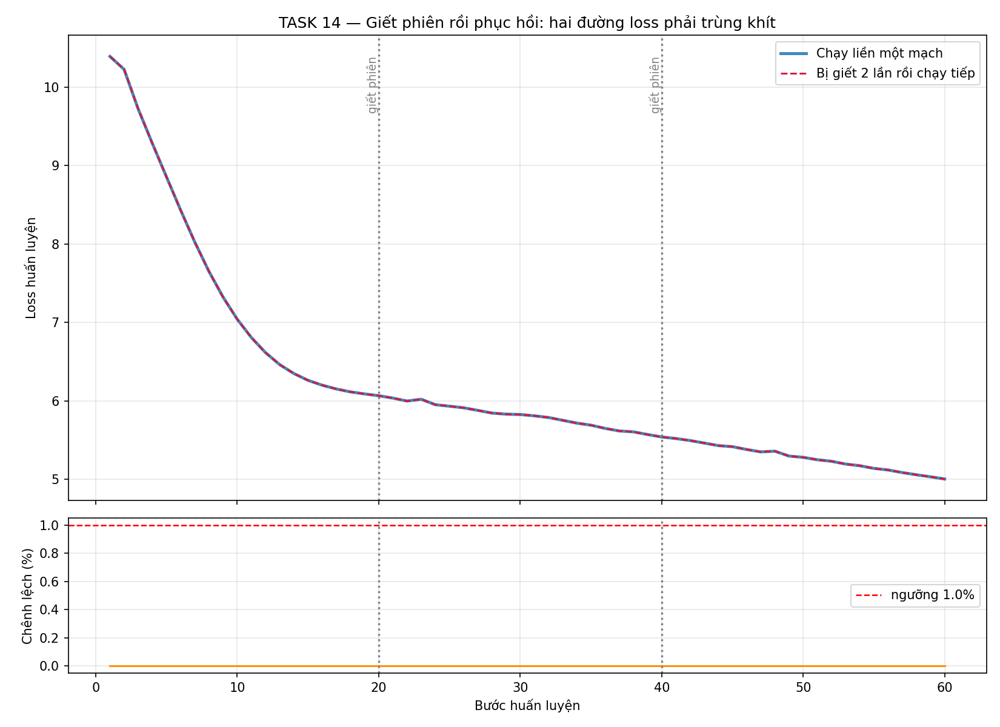
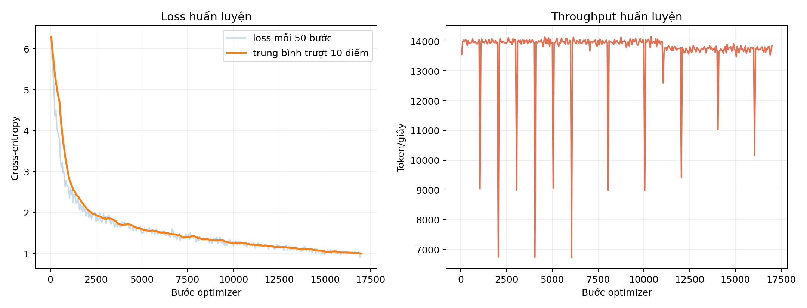
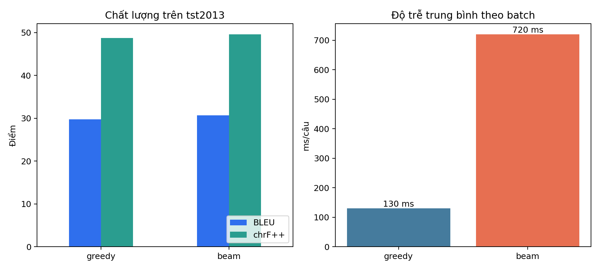
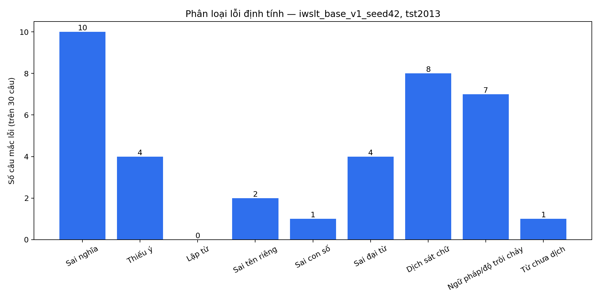

# Báo cáo tổng hợp đồ án ENVI-NMT

> Ngày cập nhật: 08/09/2026 · Ngày nộp và chữ ký thành viên: **nhóm điền trước khi nộp**.
>
> Những ô “chưa có” được giữ nguyên có chủ ý; không dùng số smoke hoặc số tự
> suy đoán thay cho thí nghiệm GPU thật.

## Tóm tắt

Đồ án xây dựng Transformer encoder–decoder Anh→Việt bằng PyTorch từ đầu, không
dùng `nn.Transformer`, mô hình pretrained hay attention dựng sẵn. Hệ thống cải
tiến gồm RoPE, Pre-Norm, RMSNorm và SwiGLU. Checkpoint seed 42 tại bước 6.000 đạt
29,74 tokenized SacreBLEU với Greedy và 30,69 với Beam-4 trên toàn bộ IWSLT 2015
`tst2013`. Beam tăng 0,95 BLEU nhưng tốn thời gian suy luận hơn. Phần so sánh
vanilla và ablation hai seed đã khóa protocol/code chạy, song còn thiếu 15 lượt
GPU nên chưa được dùng để kết luận đóng góp nhân quả của từng thành phần.

## 1. Dữ liệu và tiền xử lý

**Bảng 1 — Quy mô benchmark tự đo**

| Split | Trước lọc | Sau lọc | Vai trò |
|---|---:|---:|---|
| train | 133.317 | 131.339 | huấn luyện |
| tst2012 | 1.553 | 1.553 | dev/chọn checkpoint |
| tst2013 | 1.268 | 1.268 | test cuối |

**Bảng 2 — Nguyên nhân loại khỏi train**

| Rỗng | Trùng | Quá dài | Lệch độ dài | Rò rỉ dev/test | Tổng loại |
|---:|---:|---:|---:|---:|---:|
| 151 | 1.006 | 760 | 40 | 21 | 1.978 |

**Bảng 3 — Chất lượng BPE 32k tự đo**

| Fertility train EN | Fertility train VI | UNK train | UNK dev |
|---:|---:|---:|---:|
| 1,0664 | 1,0137 | 0,0000% | 0,0000% |

## 2. Kiến trúc và hyperparameter cuối

**Bảng 4 — Cấu hình bắt buộc để tái lập**

| Nhóm | Giá trị |
|---|---|
| Encoder / decoder | 6 lớp / 6 lớp |
| `d_model` | 512 |
| Attention | 8 head, **64 chiều/head** |
| FFN | SwiGLU, `d_ff=688` |
| Vị trí | RoPE theta 10.000; chỉ self-attention |
| Chuẩn hóa | RMSNorm, Pre-Norm, final RMSNorm |
| Vocab / embedding | 32.000; chia sẻ encoder–decoder–output |
| Dropout | 0,3 |
| Optimizer | AdamW, lr 7e-4, betas (0,9; 0,98), eps 1e-9, weight decay 0,01 |
| Scheduler / smoothing | learning rate cố định / label smoothing 0,0 |
| Batch | 4.096 token/micro-batch, cộng dồn 4 bước |
| Ổn định | clip grad norm 1,0; fp16 + GradScaler trên T4 |
| Seed | 42 (kết quả hiện có), 1337 (protocol ablation còn thiếu) |
| Ngân sách đối chứng | đúng 6.000 optimizer step, không early stop trước mốc |

**Bảng 5 — Số tham số từ model thật**

| Thành phần | Tham số |
|---|---:|
| Embedding dùng chung | 16.384.000 |
| Encoder + final norm | 12.638.720 |
| Decoder + final norm | 18.933.248 |
| Output riêng | 0 (chia sẻ embedding) |
| **Tổng** | **47.955.968** |

Baseline vanilla khớp quy mô có 47.872.000 tham số, chênh 0,175%; nó dùng
sin-cos, Post-Norm, LayerNorm và ReLU (`d_ff=1024`).

**Bảng 6 — Khảo sát cấu hình trên T4**

| Lớp | Head | Tham số | Token/giây | VRAM đỉnh |
|---:|---:|---:|---:|---:|
| 4 | 4 | 37.432.320 | 17.814 | 6.959 MB |
| 4 | 8 | 37.432.320 | 17.114 | 7.025 MB |
| 6 | 4 | 47.955.968 | 13.604 | 8.016 MB |
| **6** | **8** | **47.955.968** | **13.100** | **8.112 MB** |

## 3. Kiểm chứng và huấn luyện

Mọi checkpoint lưu model, optimizer, scaler và RNG. Thí nghiệm giết phiên cho
loss sau resume trùng lượt liên tục ở cả 60/60 bước.

**Bảng 7 — Khả năng phục hồi tự đo**

| Bước so sánh | Số bước khớp | Chênh loss lớn nhất | Kết luận |
|---:|---:|---:|---|
| 1–60 | 60 | 0,000000% | đạt |

**Hình 8 — Loss và throughput huấn luyện**

Checkpoint dùng đánh giá có metadata thật: bước 6.000, epoch 34, loss dev
2,2364, seed 42. Log train còn ghi quá trình tiếp tục đến bước 17.000; báo cáo
phân biệt rõ log tối ưu với checkpoint tốt nhất được chấm.

## 4. Kết quả đánh giá

Corpus đã tách token, do đó protocol chính là SacreBLEU `tokenize=none`.

**Bảng 9 — Điểm full benchmark**

| Split | Search | Số câu | BLEU | chrF++ |
|---|---|---:|---:|---:|
| tst2012 | Greedy + cache | 1.553 | 26,24 | 45,57 |
| tst2013 | Greedy + cache | 1.268 | 29,74 | 48,73 |
| tst2013 | Beam-4 + cache | 1.268 | **30,69** | **49,60** |

BLEU signature: `nrefs:1|case:mixed|eff:no|tok:none|smooth:exp|version:2.6.0`.
chrF++ signature: `nrefs:1|case:mixed|eff:yes|nc:6|nw:2|space:no|version:2.6.0`.

**Hình 10 — Đánh đổi Greedy/Beam tự đo**

Beam tăng 0,95 BLEU, đạt tiêu chí TASK 19 (+0,5).

**Bảng 10b — Benchmark Greedy CPU trên 200 câu**

| Cache | p50 | p95 | Câu/giây | BLEU mẫu |
|---|---:|---:|---:|---:|
| tắt | 891,6 ms | 3.469,4 ms | 0,773 | 27,60 |
| bật | **343,6 ms** | **937,9 ms** | **2,413** | 27,60 |

## 5. Phân tích lỗi định tính

30 câu đầu tst2013 được đọc và gán nhãn thủ công, cho phép một câu mang nhiều
nhãn. BLEU của mẫu không thay cho full test.

**Bảng 11 — Phân loại lỗi trên 30 câu**

| Nhóm | Số câu | Tỉ lệ |
|---|---:|---:|
| Sai nghĩa | 10 | 33,3% |
| Thiếu ý | 4 | 13,3% |
| Lặp từ | 0 | 0,0% |
| Sai tên riêng | 2 | 6,7% |
| Sai con số | 1 | 3,3% |
| Sai đại từ | 4 | 13,3% |
| Dịch sát chữ | 8 | 26,7% |
| Ngữ pháp/độ trôi chảy | 7 | 23,3% |
| Từ chưa dịch | 1 | 3,3% |

Các lỗi đáng chú ý: `public execution`→“cuộc hành trình công cộng”, `power
outages`→“quyền lực”, `bugs`→“thiên chúa”, `repatriated`→“bị phạt”, và model
tự sinh “20 tuổi”. Bảng từng câu nằm trong `results/phan_tich_loi_30_cau.csv`.

## 6. Ablation và baseline

**Bảng 12 — Trạng thái phép so đã đăng ký trước**

| Cấu hình | Seed 42 | Seed 1337 |
|---|---|---|
| Cải tiến | BLEU 29,74 | chưa train |
| Vanilla 2017 khớp quy mô | chưa train | chưa train |
| A1 LayerNorm | chưa train | chưa train |
| A2 Warmup | chưa train | chưa train |
| A3 Label smoothing 0,1 | chưa train | chưa train |
| A4 Sin-cos | chưa train | chưa train |
| A5 ReLU | chưa train | chưa train |
| A6 Post-Norm | chưa train | chưa train |

Vì thiếu các vế đối chứng, báo cáo **chưa kết luận** RoPE/RMSNorm/SwiGLU hay
Pre-Norm là nguyên nhân tạo ra điểm 29,74. Manifest 16 lượt và runner GPU đã có.

## 7. Giới hạn

1. Mới có một seed của hệ thống cải tiến; chưa ước lượng phương sai seed.
2. Thiếu 15 lượt baseline/ablation GPU, nên chưa chứng minh đóng góp riêng hay
   tổng hợp so với vanilla Transformer 2017.
3. Test chỉ có một tham chiếu; bản dịch hợp lệ khác cách diễn đạt vẫn bị BLEU phạt.
4. Phân tích lỗi dùng 30 câu liên tiếp của một TED talk và một người gán nhãn.
5. Model có lỗi từ đa nghĩa/tên riêng và đôi lúc hallucinate con số.
6. Demo Space công khai cần tài khoản nhóm tạo/push; local Docker đã chạy nhưng
   URL public chưa được tuyên bố.
7. ONNX/INT8 chưa đo; bảng latency hiện chỉ đưa số PyTorch thực đo.

## 8. Xác minh bản bàn giao kỹ thuật

- Bộ test không gồm bài train chậm: **104 passed, 1 skipped, 1 deselected**.
- Mã trong `scripts/` và `src/` đã qua `compileall`.
- Docker image build thành công; container local trả health HTTP 200 và đã dịch thật bằng
  checkpoint bước 6.000.
- PowerPoint sinh tự động mở lại thành công, đủ 15 slide.
- Bài overfit 50 câu đã có artifact từ lần chạy trước. Lần chạy lại toàn bộ trên máy Windows
  CPU không được dùng làm bằng chứng vì thời gian quá dài; DataLoader đã được sửa dùng
  `num_workers=0` trên Windows để tránh treo do cơ chế multiprocessing `spawn`.
- Manifest ablation có đủ 16 lượt (8 cấu hình × 2 seed), nhưng bảng kết quả chỉ ghi số đo
  cho checkpoint thực sự tồn tại, tuyệt đối không nội suy 15 lượt chưa train.

## Tài liệu tham khảo

- Vaswani et al. (2017), [Attention Is All You Need](https://arxiv.org/abs/1706.03762).
- Nguyen & Salazar (2019), [Transformers without Tears](https://aclanthology.org/2019.iwslt-1.17/).
- Jones et al. (2020), [Representation Transfer for NMT](https://aclanthology.org/2020.tacl-1.53/).
