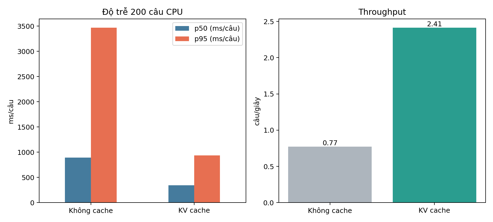

# Đo độ trễ — TASK 20

Đo tuần tự 200 câu đầu `tst2013` trên CPU, warmup 3 câu cho mỗi phương án.
Checkpoint, câu nguồn, Greedy và độ dài tối đa giống nhau; chỉ thay KV-cache.

| Runtime | Cache | p50 | p95 | Câu/giây | Model | BLEU mẫu |
|---|---|---:|---:|---:|---:|---:|
| PyTorch CPU | tắt | 891,6 ms | 3.469,4 ms | 0,773 | 549,0 MB | 27,60 |
| PyTorch CPU | bật | **343,6 ms** | **937,9 ms** | **2,413** | 549,0 MB | 27,60 |

KV-cache tăng throughput 3,12 lần, giảm p50 61,5% và p95 73,0%, đồng thời giữ
nguyên từng câu nên BLEU không đổi. CSV gốc: `results/benchmark_latency.csv`.

Docker image đã build thật có kích thước 449.916.917 byte (~429 MiB). Lệnh
`docker compose up -d --build` chạy thành công và health endpoint trả HTTP 200.

ONNX và ONNX INT8 là phần mở rộng chưa cài/đo. Không có dòng số giả cho hai
runtime này; kết luận hiệu năng hiện chỉ áp dụng cho PyTorch CPU.
